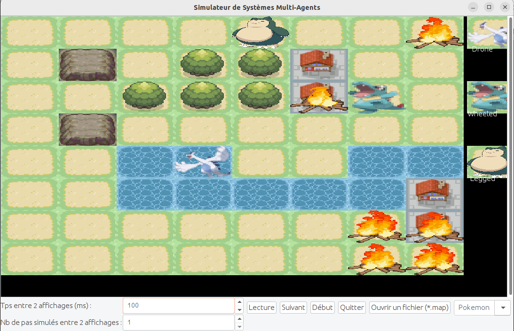

# Manuel utilisateur


## Compilation et exécution
Dans le dossier principal, un Makefile permet de compiler et exécuter facilement. 
- Pour la compilation, il suffit d'entrer la commande suivante dans le dossier principal :

```bash
make 
```
- Pour l'exécution, entrez la commande suivante, toujours dans le dossier principal :
```bash
make exeLecture
```

## Interface graphique



### Utilité des différents boutons

- Lecture/Pause : lance la simulation complète/met en pause la simulation.
- Suivant : effectue l'étape suivante dans la simulation.
- Début : si la simulation est en cours, elle est alors arrêtée; sinon, ce bouton permet de la réinitialiser.
- Quitter : arrête la simulation et ferme l'interface graphique
- Ouvrir un fichier : permet de changer de fichier (de type map) tout en gardant l'interface graphique active
- Pokemon/Pacman/Mario : change le visuel de la simulation (il y en a pour tous les goûts !)
