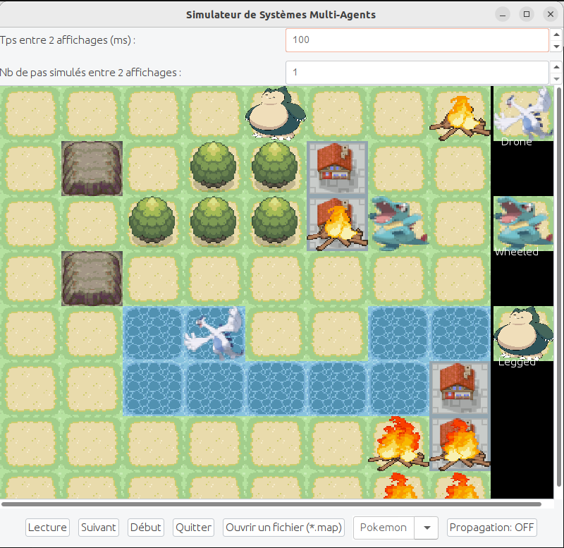

# Manuel utilisateur


## Compilation et exécution
Dans le dossier principal, un Makefile permet de compiler et exécuter facilement. 
- Pour la compilation, il suffit d'entrer la commande suivante dans le dossier principal (projet-poo, la racine):

```bash
make 
```
- Pour l'exécution, entrez la commande suivante, toujours dans le dossier principal (cette commande ouvre une carte par défaut qui est ensuite modifiable sur l'interface graphique) :
```bash
make exeLecture
```

- Pour compiler sans la commande ```make```, la commande ```javac``` est également fonctionnelle :

```bash
javac -d bin -sourcepath src src/Main.java
```
- Puis pour l'exécution sans ```make``` (en remplaçant carte par le nom d'une carte, qui sont disponibles dans le dossier cartes/ ):
```bash
java -classpath bin Main cartes/<carte>.map
```

## Nettoyage du projet 

- Pour nettoyer tous les fichiers sources et les fichiers inutiles, il suffit d'utiliser la commande suivante :

```bash
make clean
```

## Javadoc
- Pour générer la documentation Javadoc, la commande ci-dessous est fonctionnelle :
```bash
make docs
```
- Il est ensuite possible de l'ouvrir avec la commande suivante : 
```bash
firefox docs/index.html
```

## Interface graphique



### Utilité des différents boutons

- Lecture/Pause : lance la simulation complète/met en pause la simulation.
- Suivant : effectue l'étape suivante dans la simulation.
- Début : si la simulation est en cours, elle est alors arrêtée; sinon, ce bouton permet de la réinitialiser.
- Quitter : arrête la simulation et ferme l'interface graphique
- Ouvrir un fichier : permet de changer de fichier (de type map) tout en gardant l'interface graphique active
- Pokemon/Pacman/Mario : change le visuel de la simulation (il y en a pour tous les goûts !)
- Propagation (ON/OFF): active ou désactive la propagation des feux lors de la simulation

